# opentrig

> ***open***-source ***trig***ger system

An open-source, integrated, particle physics data acquisition system (DAQ).

Designed to interface with timing systems controlled by the [AIDA-2020 TLU](https://gitlab.com/ohwr/project/fmc-mtlu).
Up to 24 digital trigger channels with variable-gain threshold setting.


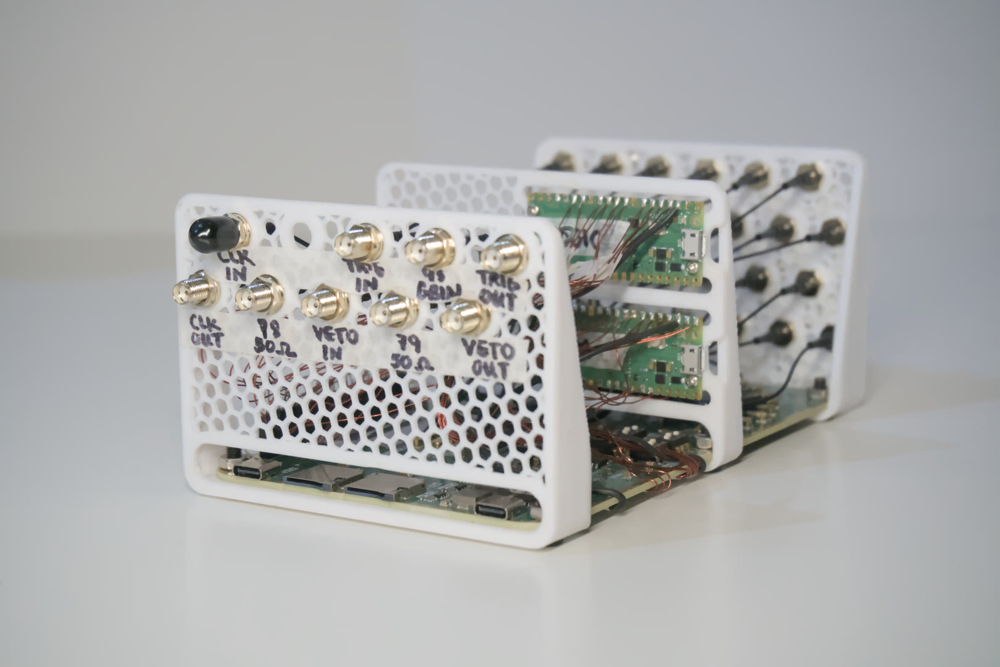


## Features

- 144 MHz internal FPGA clock, and timing resolution
- 24 digital trigger channels with variable gain
- Input voltage range 3.3V-5V
- TTL level compatible clock, trigger, input and output
- [AIDA-2020 TLU synchronous AIDA mode](https://gitlab.com/ohwr/project/fmc-mtlu/-/raw/master/Documentation/Main_TLU.pdf?ref_type=heads) (page 31) compatible FPGA


## Hardware Overview

[**Schematics can be found here.**](hardware/digital.pdf)

Front panel IO (left)
- Input clock signal (<40 MHz square wave)
- Output clock signal (120 MHz square wave, 3.3V TTL, <0.5% jitter, phase-locked)
- Input/output trigger (3.3V TTL)
- Input/output veto (3.3V TTL)
- Extra 50R impedance-matched inputs

Back panel (right)
- 24 channel digital inputs, with variable trigger thresholds (1.024 mV steps):
    - 0.000V-2.000V (1x gain)
    - 0.000V-4.000V (2x gain)

Internal components
- Low drift 5.000V reference (TI REF5050AIR)
- 12 high-speed thresholding comparators (TI TLV3502)
- 120 MHz MCU (RP2040)
- FPGA (Lattice ICE40 HX4K)

<p align="center">
  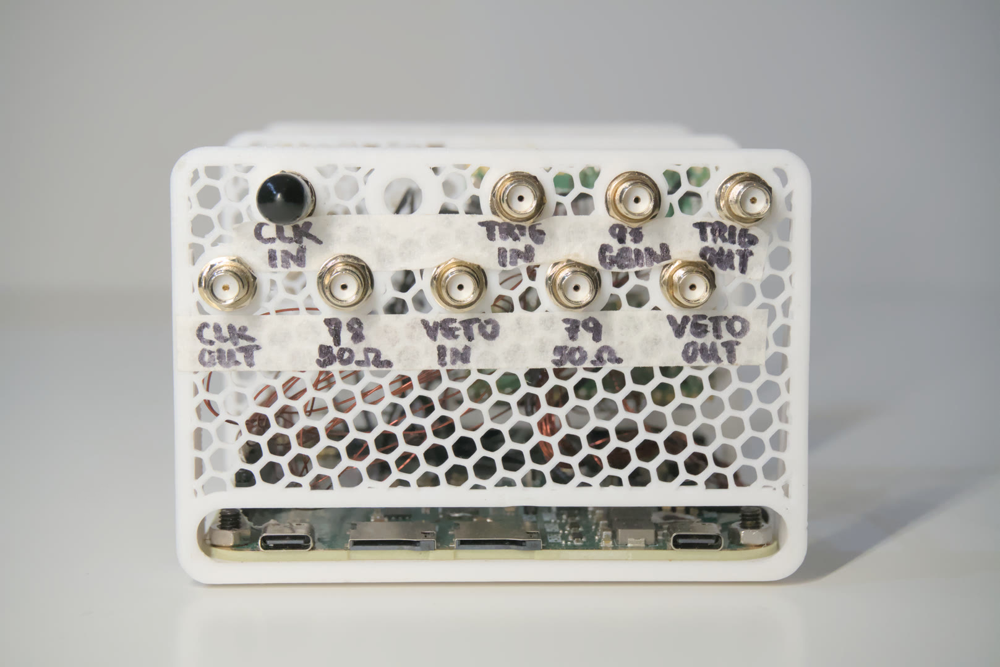
  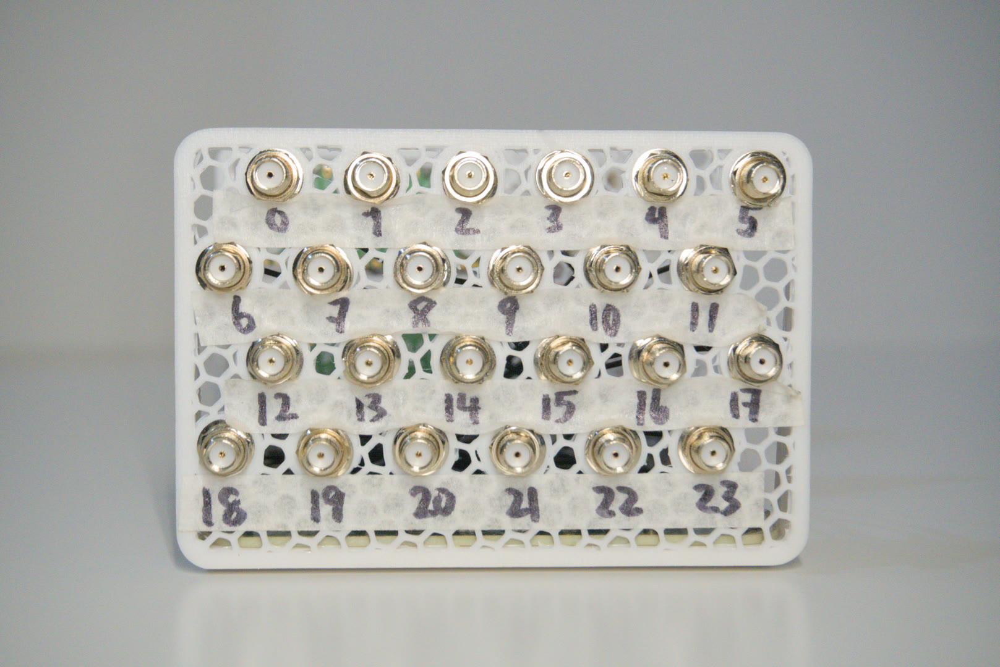
</p>


## Trigger Architecture

The *opentrig* system is a 24-channel, synchronous data acquisition platform compatible with EUDAQ2-compatible beamline trigger systems. Each channel digitizes an analog falling-edge into a digital rising-edge depending on a threshold set by independent digital-to-analog converters (DACs). Three trigger sources are fed into a selectable OR-ing gate, which allows for the selection of the interrupt source(s) for sample recording.

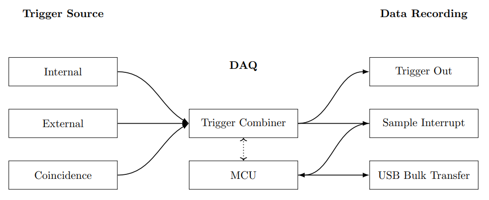

The trigger combiner vetoes priority in regards to the inputs of selected trigger sources, and assigns FPGA SPI bandwidth to the microcontroller (MCU) for processing and sampling. An active-high trigger output is asserted with controllable duration and delay in reference to the trigger sources. The sample interrupt interacts with the MCU in order to stream data live through the USB Type-C interface across bulk transfer.

### Trigger Delay

The delays incurred by the trigger is synchronized across channels by means of length matching. The largest skew is a result of level shifting: indeed up to $\pm 0.3$ ns across channels. No significant differences are measured in practice. FPGA gate skew is below the delays of level shifting, and are thus negligible in practice. PCB traces are delay-matched to within $\pm0.01$ mm. Given the assumption that channels are synchronized between each other, the input-output delay needs to be considered.

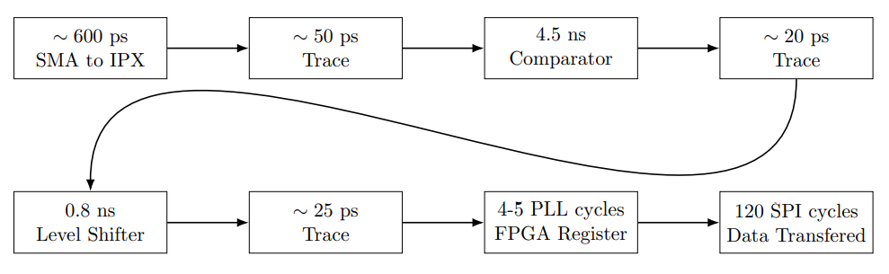

## Clocks

The FPGA PLL is synchronized to a sampling clock of $120$ MHz, while the SPI clock transfers data at a rate of $5$ MHz. The user can select an internal clock input or an external clock input, both requiring different PLL clock dividers to achieve the full sampling rate at $120$ Msps.

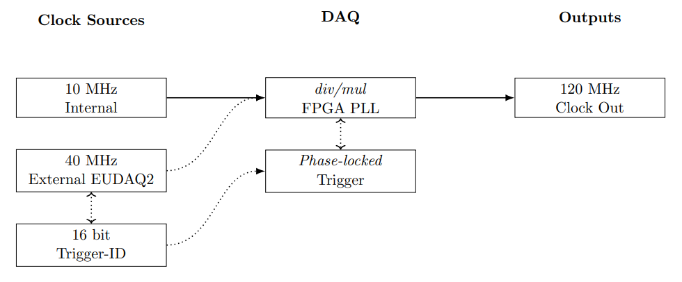

Clocks are phase-aligned by phase-locked-loop (PLL). An internal clock can be generated for the independent functioning of the DAQ. Proper PLL clock dividers and multipliers must be set to achieve the target $120$ MHz. An external clock compliant to EUDAQ2 trigger systems, such as the AIDA-2020 TLU, can be synchronized to \textit{opentrig}. A 16-bit trigger-ID can be read synchronously by the phase-locked external trigger module, which will be recorded upon the assertion of a sample interrupt.


## Voltage Levels

The 24 analog inputs are limited to a voltage range of $-0.30$ V to $+5.30$ V on wide-gain mode, and $-0.30$ V to $+3.30$ V on limited-gain mode. A voltage beyond permissible levels may cause irreversible damage to thresholding comparators, whose inputs are directly connected to SMA connectors.

The digital signals are high-impedance or $50 \Omega$ terminated depending on the label, and function on $3.3$ V CMOS voltage levels. The push-pull drivers have weak drive capabilities; therefore, only small digital loads may be attached with matched impedance.


## Directory Structure

The hardware is designed in [KiCad](https://www.kicad.org/) for the digital trigger front-end and mechanical layout, while the firmware and control utilities are written in [Rust](https://rust-lang.org/) using the [Embassy](https://embassy.dev/) embedded framework. The FPGA subsystems are written in pure Verilog with the [Yosys](https://github.com/YosysHQ/yosys.git) open-source toolchain, and [Project Icestorm](https://github.com/YosysHQ/icestorm)'s bitstream documentation.

```
opentrig/
├── hardware/ # KiCad hardware design
│   ├── fab/ # Fabrication files and gerbers
│   ├── logos.pretty/ # Custom logo footprints and graphics
│   └── digital.pretty/ # Custom digital footprints and component libraries
│
├── opentrig/ # Core DAQ firmware
│   ├── src/ # Source code (Rust + Embassy)
│   │   └── fpga/ # FPGA interface and logic modules
│   └── target/ # Compiled firmware output and build artifacts
│
├── cli/ # Command-line interface for control and configuration via host computer
│   ├── src/ # Rust source for CLI utilities
│   └── target/ # Compiled CLI binaries
│
├── tests/ # Automated and hardware-in-the-loop test framework
│   ├── src/ # Unit and integration test sources
│   └── target/ # Compiled test binaries and reports
│
└── README.md # Project overview, setup, and usage instructions
```

## Building

Before building the firmware and FPGA bitstream, you need to install a few dependencies for Rust and the FPGA toolchain. Follow these steps:

- Install [Rust](https://www.rust-lang.org/) – the firmware is written in Rust using the Embassy framework.
- Install [Just](https://github.com/casey/just) – used to run the build commands.
- Install [Yosys](https://github.com/YosysHQ/yosys) – for Verilog synthesis of the FPGA.
- Install [Project Icestorm](https://github.com/YosysHQ/icestorm) tools – for routing and bitstream generation for iCE40 FPGAs.
- Optional: [KiCad](https://www.kicad.org/) – for viewing and editing hardware schematics.

Once dependencies are installed, clone the repository, navigate to the firmware folder, and run the build commands:

```bash
# Clone the Protovolt repository from GitHub
git clone https://github.com/Dawson-HEP/opentrig.git

# Go to firmware directory
cd opentrig/opentrig
```

```bash
# Compile verilog bitstream
just build-verilog

# Compile embedded firmware
just build-rust
```

Flashing:
- SWD debug port on the PCB
- USB flashing via data port


## Running the DAQ
A USB Type-C Power Delivery (PD) supply must be connected to the power connector to bias analog and digital circuitry. A $100$ W-capable supply with $20$V output is preferred to provide enough margin for buck converters and analog filtering supplies to function properly. A digital data cable links the data acquisition computer with the DAQ.

## Debugging the DAQ
Three SWD debug interfaces are made available to the user: the main *opentrig* MCU debug link, the simulation PICO link, and the logic analyzer PICO link. The MCU flash process includes the FPGA bitstream, which is written upon power up of the DAQ. The simulation PICO, when powered, produce triggers via the internal links directly to the FPGA, which allows for programmatic debugging. The logic analyzer serves as a bitstream debugger, where internal registers and wires can be sampled.


## DESY Test Beam

The interfacing with the AIDA-2020 TLU functionality has been verified at the [DESY II Test Beam facility](https://desy.de/index_eng.html) in September of 2025, as part of the [Beamline for Schools](https://beamlineforschools.cern/) Competition. 

*Testbeam Area 21, Translation Stage*
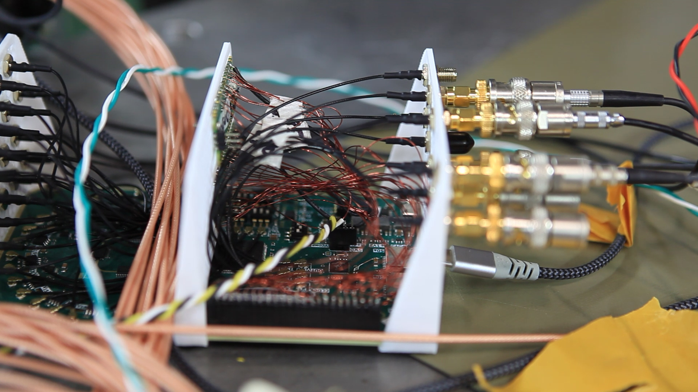

## Gallery

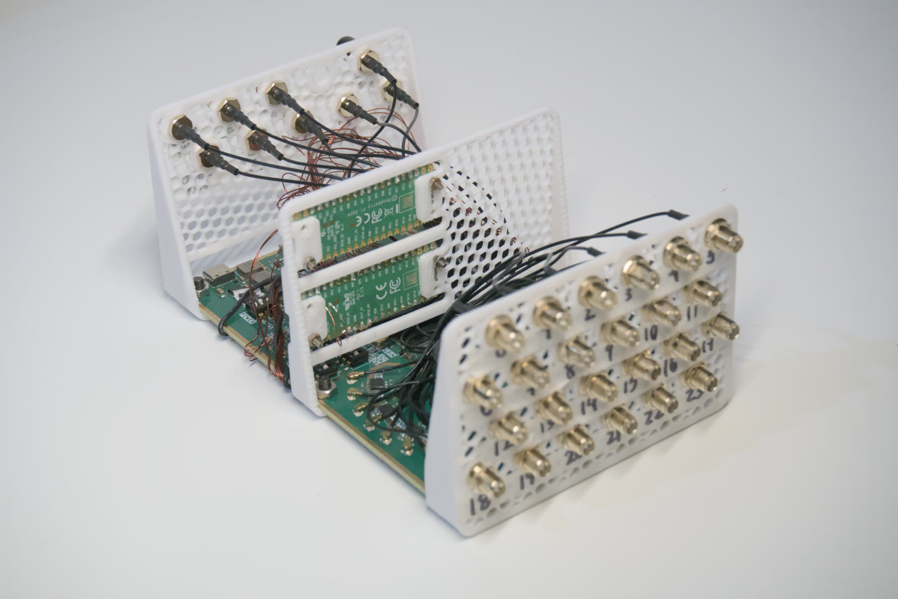
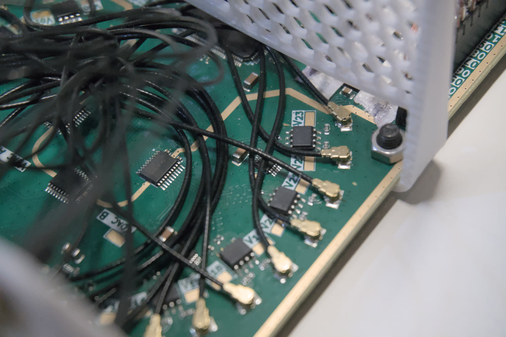
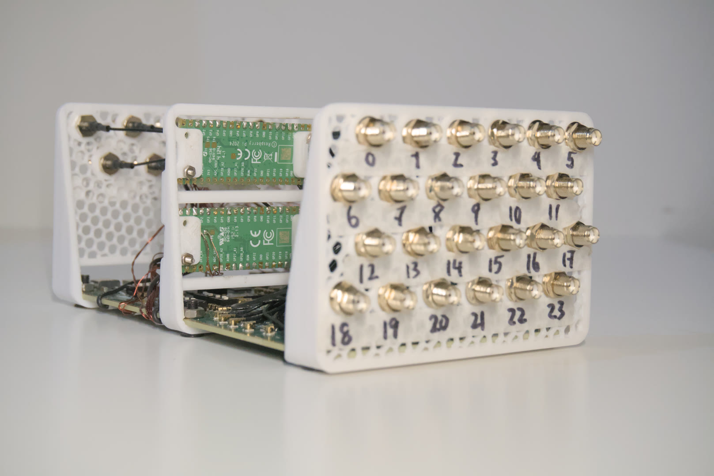
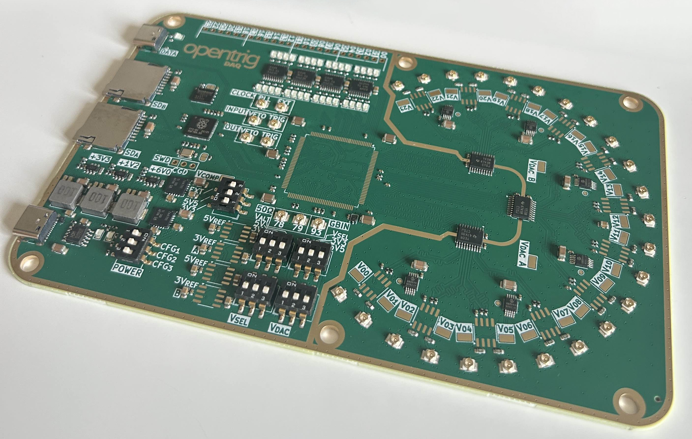


## License

This project is open-source under the Eclipse Public License - v 2.0.

## Authors

- [Tian Yi, Xia](https://github.com/ThatAquarel), xtxiatianyi@gmail.com
- [Leandro Perez-Moran](https://github.com/LudioRex), pemle2007@gmail.com
